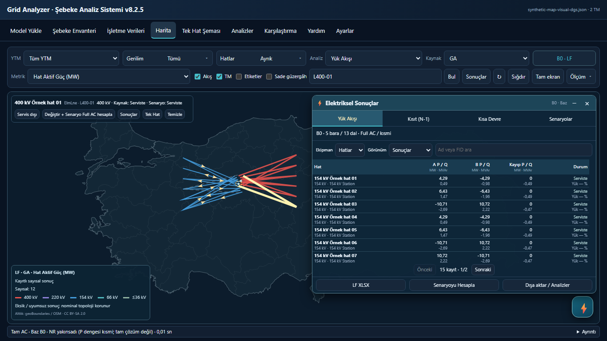
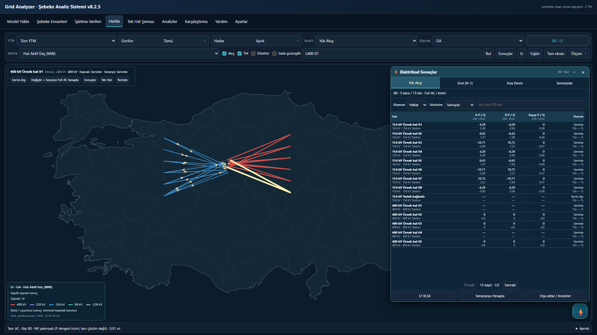

# Masaüstü harita, mühendislik kartları ve ⚡ sonuç kabulü — 2026-10-11

Dal: `fix/desktop-map-six-metrics-compact-results-20261011`. Başlangıç: `37eb511d9767182e0056719dc4798f36dda08fb8`. Uygulama: `fb346df3cbb545e956e7b8bb4930517894168bb6`; ayrık bara renk düzeltmesi: `6723fe0f581a4d4a5e1e473a65770d1f5e599597`. Bu raporu ekleyen commit yalnız teslim kanıtıdır.

`main` değiştirilmedi: `3e20615131f4c419dda80ee1df1a02c2bfcb313f`. Merge, cherry-pick, rebase ve dal silme yapılmadı. Araştırma dallarından hesap motoru değişikliği alınmadı.

## Uygulanan değişiklikler

- `src/map/layer-policy.ts`, `benchmark-controls.ts`: LF ana seçiminde tam altı metrik; bara U(kV)/açı, hat P/Q, trafo HV P/Q. Nesne tipi açık; trafo gücü hat oklarını çalıştırmaz. N1 P/tahmini yük/POST−PRE ve gerçek AC kaydıyla Q/U/ihlal; SC Ikss/Skss. Eski N1 ada/termik görünümleri Ölçüm > Topoloji içinde korunur. Doğrulanmış GA−PF farkı gerçek hücre/yöntem kapısı olmadan etkinleşmez; değiştirilmiş senaryoya B0 PF sayıları taşınmaz.
- `src/map/equipment-tooltip.ts`, `canvas-renderer.ts`: güvenli DOM, 390 px mühendislik kartı, en fazla 250 px yükseklik. TM'de en yüksek nominal katmanın en yüksek ölçülen barası ve aynı baranın açısı; hat iki uç P/Q/U/açı ve kayıp; nominal uçları doğrulanmış trafo HV/LV, kayıp/tap/durum. Eksik/nonfinite değer `—`, gerçek sıfır `0,00`. Tam provenance ayrıntı/export içinde kalır. Ayrık bara işaretleri sonuç overlay'inde görünür; her baranın rengi yalnız kendi doğrulanmış partisyonundan alınır.
- `src/help/context-help.ts`, `registry.ts`, `src/features/help/registry-view.ts`, `src/ui/components/voltage-filter.ts`: tek yardım balonu; sadece kısa etiket metninde 550 ms hover veya Tab ile etiket odağı. Kontrol yüzeyi/mouse focus açmaz; Escape, ayrılma, scroll, dış tık kapatır.
- `src/map/lightning-panel.ts`, `src/features/analysis/{workspace-results,result-table,result-columns}.ts`, `src/features/quality-n1/results-view.ts`: tek 36 px LF/N1/SC/Senaryolar satırı; LF Ekipman/Görünüm seçicileri, kompakt tablo, bağımsız scroll, satır işlemleri ve XLSX. N1 case/phase/source harita, panel ve Analizler ile eşleşir; seçim hesap başlatmaz. DC kaydı Q/U/AC ihlal gibi gösterilmez. SC BLOCKED/null ve NETWORK_APPROXIMATION destek sınırı açıkça gösterilir. Senaryo defteri, dallanma, geri al, karşılaştırma ve panel kapatırken sekme durumu korunur.
- `src/map/map-view.ts`, `src/app/app-shell.ts`, `src/styles/ui-workspace.css`: Sade güzergâh Etiketler'in hemen yanında; kapasite/ikincil ölçüm ayarları Ölçüm içinde. Üst hesap kartı kaldırıldı; haritanın altında tek 26 px aktif analiz durum satırı ve Ayrıntı var. Haritada genel uygulama footer'ı tekrar gösterilmez.

`src/analysis`, `src/domain`, `src/workers`, `src/importers`, paket ve kilit dosyalarında başlangıca göre **sıfır değişiklik**. pu, kanonik sonuçlar, benchmark/export şemaları ve solver girişleri korunur. Yeni bağımlılık ve mobil çalışma eklenmedi.

## Masaüstü ölçümleri ve ekranlar

| Viewport | Filtre satırları | Harita yüksekliği | Alt durum | Taşma |
| --- | --- | ---: | ---: | --- |
| 1920×1080 | 2 × 34 px | 835,77 px | 26 px | 0 |
| 1600×900 | 2 × 34 px | 655,77 px | 26 px | 0 |
| 1440×900 | 2 × 34 px | 655,77 px | 26 px | 0 |
| 1366×768 | 2 × 34 px | 523,77 px | 26 px | 0 |

LF, N1 ve SC vaka/fault kontrolleri dört viewport'ta ölçüldü. ⚡ paneli en fazla 640 px, aile satırı 36 px; açılıp kapanması harita yüksekliğini değiştirmedi. Önceki 1366 harita yüksekliği 485,77 px idi: **38 px artış**. P/Q hareketi gerçek canvas piksellerinden; bölünmüş bara, nominal hat renkleri ve kart boyutları DOM/canvas üzerinden doğrulandı. Filtre/seçim/panel eylemleri ek hesap göndermedi; haritadan ayrılınca RAF durdu.

İki yeni yayımlanan ekran yalnız açık sentetik veridir. Açık sentetik 154 kV kuplaj, ayrık bara sembolünün kabulü içindir; gerçek veriye rota/koordinat eklenmedi.

## Test ve portable kanıtı

Sekiz yeni test: altı metrik/nesne hedefi; kV nominal kimliği/null/zero; TM kademe ve aynı bara açısı; hat/ters yönlü trafo uçları; senaryo PF/fark kapısı; kayıtlı DC N1 vaka/Q/U kapısı; SC BLOCKED ve stale kimlik; aktif analiz/kısmi LF durumu ve ekran köşesi kart sınırları. Dosya: `tests/unit/desktop-map-presentation.test.ts`.

- Hedefli ilk küme **30/30**, son partisyon düzeltmesi sonrası ilgili küme **17/17** geçti.
- Yerel tam unit/regression **364/364**, sıfır hata/skip. Tam küme bir kez çalıştırıldı; son dar renk düzeltmesinden sonra ilgili testler tekrar çalıştırıldı; final dal CI tam kümeyi çalıştırır.
- Final typecheck ve mimari lint geçti; standart/portable build geçti. Mevcut Chromium masaüstü smoke; kayıtlı DC vaka, dört viewport, yardım gecikmesi, gerçek P/Q pikselleri, ayrık bara, kart, panel, senaryo/SLD ve export geçti. Mevcut PF benchmark smoke portable üzerinde de geçti; bilimsel pu eşleştirme testleri korunur.
- Final portable: `dist-portable/GridAnalyzer_v7.html`, **1.592.738 bayt**. SHA256: `65f43d388761615cb41c3c16bccd7a50dfb4c3518adb88f751d03f8af34cde34`. Fresh build = commit ham baytları; LF-normalize build de eşit; CRLF sıfır. `tools/portable-byte-check.ts`: tüm üç kapı true.

Push sonrası final HEAD için [dalın CI koşusu](https://github.com/murathany90/Grid_Analyzer_v7/actions/workflows/ci.yml?query=branch%3Afix%2Fdesktop-map-six-metrics-compact-results-20261011) ve canlı durum:

## Gerçek SN3 ve sayısal sınırlar

Gerçek SN3: **1 DGS import, 1 B0 Full AC**, sıfır N1/SC solve, sıfır toplu vaka/fault solve. Referans ZIP ve ControlContext mevcut açık uygulama eylemiyle yüklendi. Worker kaydı yalnız `RUN_AC` içerir. 4.077 bara / 5.140 dal, yakınsamış; mismatch `2.0407307441128175e-8 MW` önceki B0 ile aynıdır. Sonuç kısmi P dengesi olarak dürüstçe gösterilir. Gerçek veri/ekranlar yalnız ignored yerel kabul dizinindedir.

| LF hat karne satırı | Tolerans içi / eşleşen | Önceki kabul |
| --- | ---: | --- |
| 400 kV P | 327 / 328 | Aynı |
| 400 kV Q | 251 / 328 | Aynı |
| 154 kV P | 1908 / 1944 | Aynı |
| 154 kV Q | 1781 / 1944 | Aynı |

Sadece bu dört sayı değil, bütün ortak karne satırlarının `matched`, `within`, `coverage`, `agreement`, `mae`, `p95`, `maximum` alanları önceki main kabulüyle birebir karşılaştırılıp eşit bulundu. Bu tanısal kanıt PF yöntem paritesi iddiası değildir.

Gerçek dört viewport, mühendislik seçimi ve **45 ayrık bara işareti** doğrulandı. B0 vektörleri senaryo defteri üzerinden IndexedDB'ye kaydedildi ve tekrar çözmeden okunabildi. Gerçek SN3 N1 ekranı `NOT_RUN`, SC ekranı `BLOCKED`; eski LF statüsü veya sayısal sıfır kullanılmadı. **Kayıtlı sayısal DC N1 ekran kabulü açık sentetik modeldedir; yeni gerçek SN3 DC sonucu üretildiği iddia edilmiyor.** Önceden kaydedilmiş native SN3 SC BLOCKED kaydı yerelde korunur; ek salt okunur cache görünümü girişimi tarayıcı kapanması nedeniyle kabul edilmedi, başarılı kayıtlı SC ekran kanıtı olarak gösterilmiyor.

Gerçek portable çalışmasının SHA'sı `f2aeabe672a3dc11e99a5f13459d22d37d12fc92f1d5aa8d89150d1853e6fea9` / kaynak `fb346df`. Bundan sonra yalnız ayrık baranın kendi partisyon rengi ve browser kabul seçimi düzeltildi; final portable SHA farklıdır. Final UI sentetik Chromium ve CI ile doğrulanır; final SHA için ikinci gerçek import/solve yapılmadı. Sayısal motor dosyaları iki sürümde de byte-identical.

**Kalan doğrulama açığı — LF digest:** önceki yayımlanmış portable B0 digest'i `e9cf552fdd356c0fb29464897c193d647537774155c2d094ccdece917b4e6f60` ve eski kayıt dosyası korunmuştur. Bu digest'in serileştirme betiği yerelde bulunamadı; yeni kayıt ile SHA eşitliği yeniden üretilemedi. Yeni kayıt için açıkça tanımlı `sha256(stableJson({buses,branches,generators}))` değeri `0ef4ee03b26d005ab9d04efbc6f63789c324839cee1e63ea76bd1268fb64f811`'dir. İki farklı temsilin hash'ini aynı sayısal digest olarak sunmuyoruz. Bu yüzden bu kabul maddesi **UNVERIFIED**; bütün digest kabulünün geçtiği veya solver/IEC/N1 sayısal paritesinin iyileştiği iddia edilmiyor.

IEC kaynak/partition eksiği, PF ayrıntılı N1 post-case eksiği ve yöntem paritesi mevcut sınırlar olarak kalır. Bu çalışma UI/sunum geliştirmesidir.
