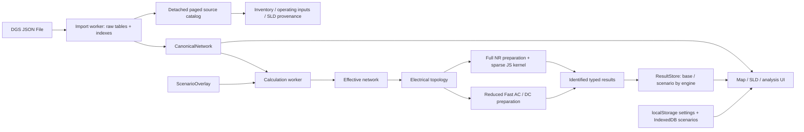

# v7 architecture



The raw DGS source stays in the import worker. Canonical objects are cloned once to
the application and once to the calculation worker; the 143 MB source JSON is not
sent again for each calculation. Detached catalog pages expose source fields only
for inspection, CSV and SLD provenance. Electrical engines and map geometry never
read raw DGS tables. The architecture lint checks these import boundaries.

`CanonicalNetwork` stores source-class/source-ID references, names, base units,
equipment status, terminal endpoints, line/transformer parameters and source
capabilities. The current Full NR uses 100 MVA per-unit conversion, the first
in-service external-grid reference and its connected island, as in the baseline.
Unserved islands are counted explicitly. Station-controller records are mapped;
there is no station/secondary-controller outer loop or PowerFactory validation.

Scenario changes are separate maps for lines, transformers, switches and terminals,
plus restored terminals, generation dispatch and load adjustments. Effective
network creation never writes the source model. Undo stores overlay snapshots;
reset returns to the empty overlay. Each equipment's “Kaynağa dön” resets that
equipment status; use scenario reset/undo to remove a whole virtual energization
and its terminal/switch changes together.

Every result includes model SHA-256, exact canonical scenario serialization,
analysis type, engine, engine version and recursively normalized options.
`ResultStore` rejects stale results. Delta additionally requires matching model,
engine/version/options and converged results, aligns branches by class and source
ID, and compares electrical buses only when their member-terminal sets match.
Missing or newly removed values remain unavailable, never fabricated zeroes.

Full NR is split into Ybus construction, power injections, Jacobian, CSR/ILU0,
GMRES/BiCGSTAB and outer NR/Q-limit orchestration. Inner sparse matrix operations
use typed arrays. Prepared branch parameters remain compact indexed records at
the JS boundary; the future WASM ABI will pack their columns into owned buffers.
Result numeric buffers already use transfer lists. Display metadata stays outside
these buffers. See `rust-wasm-roadmap.md` for memory ownership and error contracts.

There are two worker instances with separate lifetimes. Cancelling a calculation
terminates only its worker; a replacement worker receives the same canonical
network without reparsing the raw file. Cancelling an import terminates the source
worker. Request IDs and an application generation counter suppress late progress
and results. The source worker is retained for paged catalog requests.

The map caches geographical paths by model identity and projected paths by camera
and layout. An independent Canvas layer draws directional flow markers. Electrical
calculations never run in render loops. Result tables use bounded pagination;
the lightning panel renders fourteen data rows per page. SLD uses SVG with explicit
station/bay/regional views and source relationships; it is an automatically laid
out view, not a recreation of the original PowerFactory drawing page.

```text
src/
  app/                 contracts, controller, shell, bootstrap
  importers/dgs/       source parsing/indexes, catalog, canonical mapping
  domain/
    model/             entities, capacity metadata, seasonal reference
    scenario/          immutable overlays, signatures and undo
    calculation/       result identity
    results/           central result types and store
  topology/            electrical union/find and energization planning
  analysis/
    api/               portable engine interface and JS adapter
    power-flow/        preparation, result adaptation, split Full NR kernel
    fast-ac/           reduced network preparation and compatible AC solver
    dc/                reduced DC kernel
    diagnostics/       bounded logging
  workers/             protocol, lifecycle, import/solve worker, buffer codec
  map/                 geometry, Canvas rendering, style, filters, lightning
  features/            model, inventory, operating inputs, SLD, analysis, settings, help
  persistence/         optional browser settings and IndexedDB
  ui/components/       safe DOM, formatting, CSV/download helpers
  styles/              shared tokens and bounded responsive layouts
```

The source is modular. Only distribution is bundled as a single portable HTML.
There are no production package dependencies and no global monkey-patch chain.
